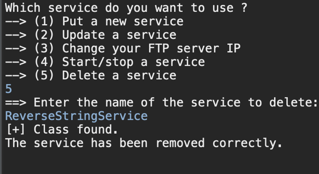

# ShareCode
A multi-client platform for services exchange between programmers and amateurs. 
The programmers post new services on a FTP Server and then can run the software to load the class dynamicly while the server still running. 
This software use massivly the Java reflection to load the services from the FTP Server. 
The communication is based on a client-server architecture, using Threads and Scanners.

<h2>The programmer view</h2>

<h3>Add a new coding service</h3>

<h3>Update an existing service</h3>

<h3>Change the FTP server URL</h3>

<h3>Start/Stop a service</h3>

<h3>Delete a service</h3>

<h2>The amateur view</h2>

<h3>Reverse a String</h3>

<h3>Validate a Json File</h3>

<h3>Check if a class is a Bean</h3>

 
